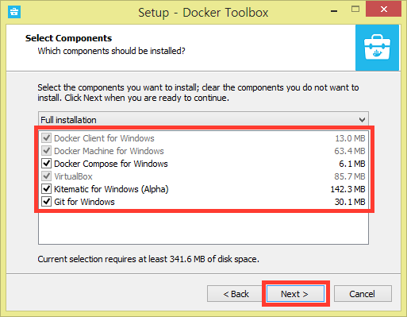
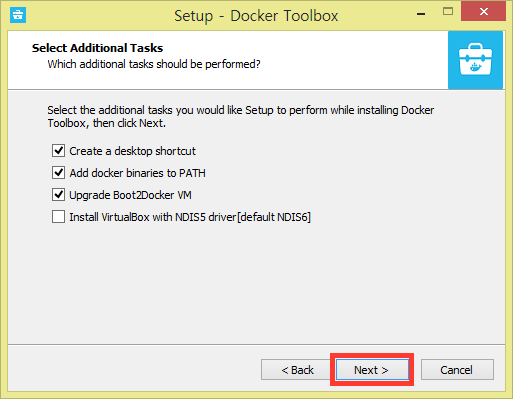
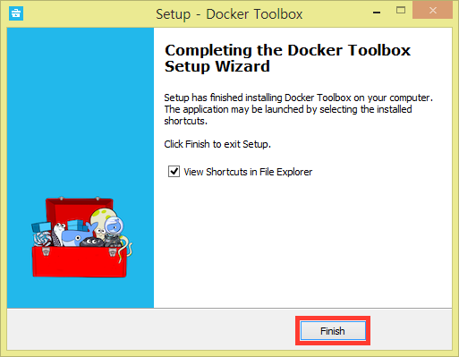
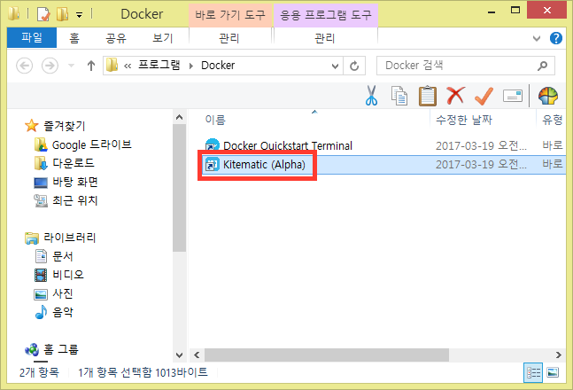
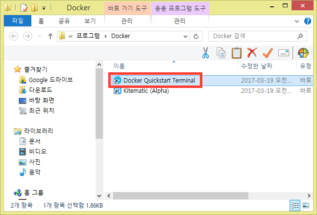
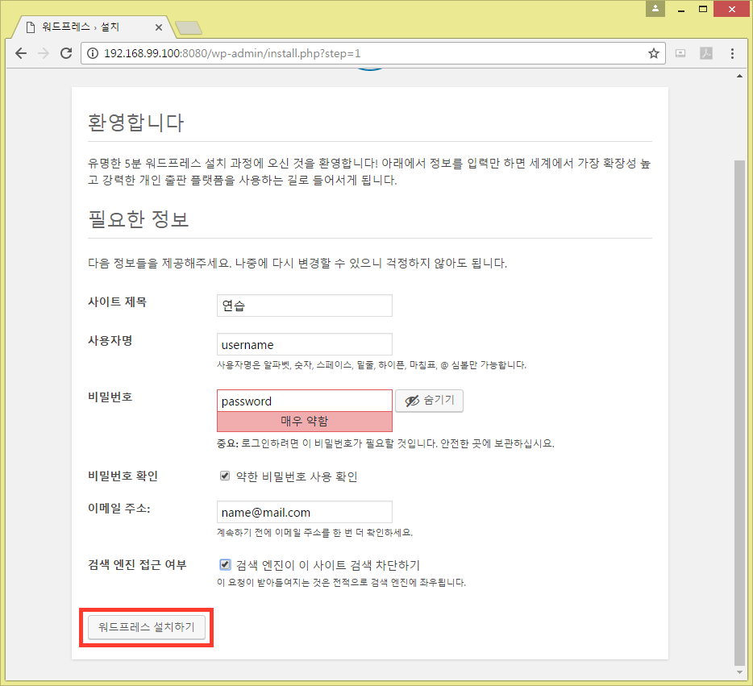
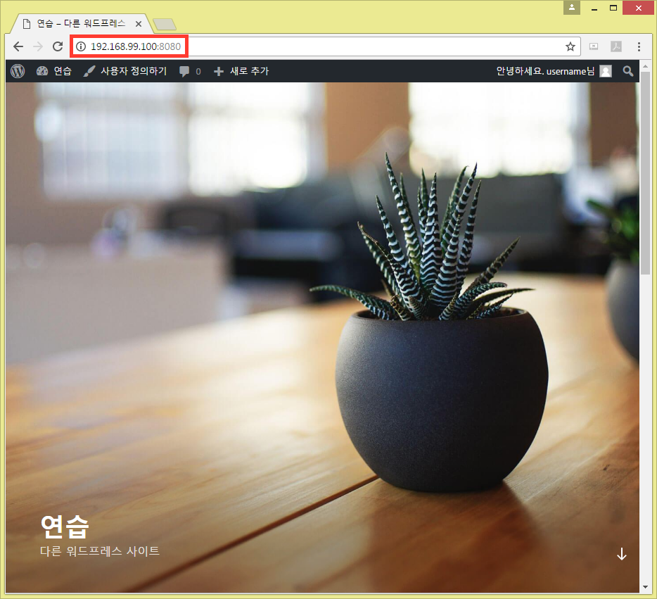

# 도커Docker로 워드프레스Wordpress 개발 환경Development Environment 구축하기

## 도커Docker 설치하기Installation

자신의 운영체제에 맞는 Docker 설치 파일을 다운로드 합니다.

- Windows 10 Pro 64-bit : [다운로드 페이지 - Get Docker](https://store.docker.com/editions/community/docker-ce-desktop-windows?tab=description)
- Windows 10 미만 또는 Windows 10 Home 64-bit : [윈도우용 Docker-toolbox 다운로드](https://www.docker.com/products/docker-toolbox)
- 32bit 윈도우는 일반적인 방식으로 Docker를 설치하기 힘듭니다. [32bit에서 설치하기](https://thesocietea.org/2016/04/installing-the-docker-client-cli-on-32-bit-windows/)
- Mac : [맥용 Docker-toolbox 다운로드](https://www.docker.com/products/docker-toolbox)

### Docker 설치하기 (Docker-toolbox 기준)

Next를 클릭하며 각 과정을 진행합니다. 기본 옵션대로 진행하면 됩니다.

### Docker Kitematic 실행하기

생성된 단축아이콘 중 Kitematic 을 실행합니다.

USE VIRTUALBOX 를 선택합니다.

일단 지금은 SKIP FOR NOW를 클릭합니다.

Docker GUI(Graphic User Interface) 환경이 준비되었습니다. 나중에 Docker 컨테이너Container를 실행하면 좌측에 리스트가 생깁니다. 명령어가 아닌 버튼 클릭으로 Docker를 사용할 수 있습니다. 다음 단계에서 워드프레스를 돌려보겠습니다.

### Docker-compose로 워드프레스Wordpress 실행하기

Docker-compose는 여러 개의 Docker Container를 쉽게 관리(연결)할 수 있는 툴입니다.

Docker Quickstart Terminal을 실행합니다. Docker를 CLI(Command Line Interface)로 사용할 수 있으며 일반적인 리눅스 환경입니다.

해당 부분(likelion)이 사용자 이름인데 혹시 한글인 경우 특정 프로그램들이 제대로 동작하지 않을 수 있습니다. 한글 경로 관련 문제가 발생하면 윈도우의 설정에서 영어로 된 새로운 계정을 생성한 후 Docker를 설치합니다.

`mkdir workspace` 명령어를 입력하여 여러분 홈 폴더(디렉토리)에 workspace라는 새로운 폴더(디렉토리)를 만듭니다. (윈도우에서는 폴더, 리눅스에서는 디렉토리라고 보통 부릅니다. 의미는 같습니다.)

`cd workspace` 명령어로 디렉토리를 변경(들어가기)합니다. 그리고 `git clone https://github.com/cycorld/wordpress.git` 명령어로 제가 준비한 Docker-compose 세팅 파일을 다운로드 합니다. 깃헙Github을 통해 이 가이드 문서와 설정 파일을 관리하고 있습니다.

다운로드가 끝나면 `cd wordpress` 명령어로 다운로드 받아진 wordpress 디렉토리에 들어갑니다. 그 후 `docker-compose up` 명령어로 워드프레스와 MySQL(데이터베이스Database) 이미지를 다운로드Download 받고 컨테이너Container를 실행합니다. 여러분은 저 명령어만 치면 모든 과정은 알아서 진행됩니다.

이미지 다운로드 과정을 확인할 수 있습니다.

더이상 로그log 내용이 나오지 않고 사진과 비슷한 내용이 나오면 아까 실행했던 Kitematic으로 돌아갑니다.

### Wordpress 설치하기

Kitematic로 돌아와서 좌측 리스트 중에 'wordpress_wordpress_1'을 클릭합니다.

오른쪽 Web Preview 영역에서 빨간 박스 표시한 링크 버튼으로 웹 브라우저에서 미리보기를 할 수 있습니다.

만약 제대로 실행 안되는 분들은 가운데 어두운 화면의 로그log에서 잘 찾아 보시면 주소를 찾을 수 있습니다. 사진의 경우에는 `http://192.168.99.100:8080`임을 확인할 수 있습니다. 브라우저를 열어서 이 주소로 접속할 수 있습니다.

워드프레스 설치 첫화면이 보입니다. 워드프레스 언어를 선택하는 화면입니다.

한국어를 선택해줍니다.

사이트 제목, 사용자명, 비밀번호 등을 입력합니다. 입력한 사용자명과 비밀번호는 관리자페이지 로그인에 필요하니 꼭 기억해두시기 바랍니다.

도메인 주소에 `/wp-admin`을 붙여 접속하면 워드프레스 관리자페이지 입니다. 설치과정에서 이미 관리자로 로그인되었습니다.

설치 완료 후 도메인 `http://192.168.99.100:8080`만을 입력하면 워드프레스 첫 화면을 볼 수 있습니다. 관리자페이지에서 작업하고 결과물을 여기서 확인할 수 있습니다. 로그아웃한 상태(일반인의 경우)에서는 상단의 검은색 관리자 바Bar가 사라집니다.

## 더 알아 볼 것들

 - Docker에서 Volume 연결하기 : 워드프레스 소스 파일을 읽고 쓸 수 있기 위해
 - 운영 환경Production Environment 세팅하는 다양한 방법
 - 데이터베이스Database 이전하기Migration
 - 플러그인/테마를 설치하는 3가지 방법 (사이트 내에서 설치 vs 사이트 내에서 업로드 vs FTP로 업로드)

